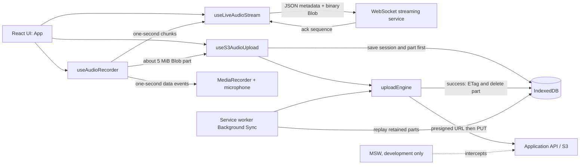

# React Record

A browser-based audio recorder that uploads recordings as Amazon S3 multipart uploads. The app preserves upload progress locally: each audio part is written to IndexedDB before it is sent, so a failed upload can be retried rather than discarded.

During local development, [Mock Service Worker (MSW)](https://mswjs.io/) simulates the application API and S3. No AWS account or backend is needed to try the project.

## Getting Started

### Prerequisites

- [Node.js](https://nodejs.org/) 20 or later
- [pnpm](https://pnpm.io/installation) 11 or later
- A modern browser with microphone access. Use `localhost` or HTTPS because `getUserMedia` requires a secure context.

### Install and run

```bash
pnpm install
pnpm dev
```

Open the URL printed by Vite. Grant microphone permission, choose the recording mode, select the play button to start a recording, use it again to pause or resume, then select stop. The download control becomes available after recording stops.

The default WebSocket URL in [App.tsx](src/app/App.tsx) is `wss://your-websocket-url`, so live streaming will not connect until it is replaced with the URL for your streaming service. The S3 upload flow and local download work independently of the WebSocket connection.

The Vite base path is `/react-record/`; the development mock worker is consequently served from `/react-record/mockServiceWorker.js`.

### Other commands

```bash
pnpm lint
pnpm build
pnpm preview
pnpm format:check
pnpm format
```

`pnpm build` type-checks the project with TypeScript and produces the production bundle. `pnpm preview` serves that bundle locally.

## Architecture



The code is organized around these responsibilities:

| Area                                                     | Role                                                                                                                                                                                   |
| -------------------------------------------------------- | -------------------------------------------------------------------------------------------------------------------------------------------------------------------------------------- |
| [App.tsx](src/app/App.tsx)                               | Connects recording controls to the upload session lifecycle.                                                                                                                           |
| [useAudioRecoder.ts](src/hooks/useAudioRecoder.ts)       | Owns microphone access, `MediaRecorder`, pause/resume state, timer, local download data, and part batching. The filename intentionally matches the repository's current spelling.      |
| [useLiveAudioStream.ts](src/hooks/useLiveAudioStream.ts) | Sends one-second audio chunks to a WebSocket, tracks sequence acknowledgments, retries unacknowledged chunks, reconnects after disconnects, and applies queue limits and backpressure. |
| [useS3AudioUpload.ts](src/hooks/useS3AudioUpload.ts)     | Starts and completes multipart sessions, writes new parts to IndexedDB, processes queued parts, detects stored sessions at startup, and retries when the browser becomes online.       |
| [idbStore.ts](src/utils/idbStore.ts)                     | Defines the small persistence API used for sessions and pending blobs.                                                                                                                 |
| [uploadEngine.ts](src/utils/uploadEngine.ts)             | Obtains presigned URLs, uploads parts with retry/backoff, and serializes queue processing with the Web Locks API when available.                                                       |
| [sw.js](src/utils/sw.js)                                 | Responds to a Background Sync event by trying pending parts again.                                                                                                                     |
| [handlers.ts](src/mocks/handlers.ts)                     | Development-only in-memory implementation of the multipart API and S3 PUT endpoint.                                                                                                    |

## Recording and Upload Lifecycle

1. `App` calls `startSession`, which requests `POST /api/s3/create-multipart` and stores an `ActiveSession` containing the upload ID, object key, and completed part metadata in IndexedDB.
2. `App` then calls `startRecording` which asks for an audio-only `MediaStream` and starts `MediaRecorder`. It receives audio data every second.
3. The recorder groups those data events until the buffered size reaches 5 MiB, the minimum S3 multipart part size. It also sends the final, smaller buffered part when recording stops.
4. For every ready 5 MiB part, `useS3AudioUpload` saves the blob and part number in IndexedDB before invoking `processUploadQueue`.
5. The upload engine requests `POST /api/s3/presign-part`, uses the returned URL for a direct `PUT` to S3, records the returned `ETag` in the session, then removes the successfully uploaded blob from IndexedDB.
6. Each part upload is retried up to three times with exponential delays of 1 second and 2 seconds. A part that still fails stays in the local queue; processing stops there to preserve part ordering.
7. On stop, the app saves the full audio recording to IndexedDB for the download fallback, then drains the queue. When no pending parts remain, it calls `POST /api/s3/complete-multipart` with the ordered list of `{ ETag, PartNumber }` values and clears the session data.

The [Web Locks API](https://developer.mozilla.org/docs/Web/API/Web_Locks_API) prevents two tabs from uploading the same session queue simultaneously. Browsers without it still process the queue, but do not get that cross-tab lock.

## Live Audio Streaming

The mode switch in the upper-right corner enables the live stream. When streaming is enabled and a recording session starts, `useLiveAudioStream` opens a WebSocket and sends a start message containing the generated session ID and the selected recorder MIME type. Each one-second recorder chunk is sent as two WebSocket messages:

1. A JSON envelope: `{ "type": "audio", "sequence": 0, "byteLength": 12345 }`.
2. The chunk's binary audio payload.

The streaming service should acknowledge each chunk with a JSON message such as `{ "type": "ack", "sequence": 0 }`. Chunks are assigned increasing sequence numbers and remain in memory until acknowledged. If the connection is unavailable, queued chunks are replayed in order after reconnecting. An unacknowledged chunk is retried after 5 seconds, up to three attempts; reconnects use exponential backoff with jitter. The client skips sends while the WebSocket buffer exceeds 1 MB and discards chunks older than 30 seconds or chunks that exhaust their retries.

Live streaming is best-effort real-time delivery, not durable storage. The queue is intentionally bounded in time and memory, and the current UI does not display a lost-chunk state. The S3 multipart path remains the durable recording path and continues to receive the same recorder events. In a production deployment, the WebSocket service should authenticate the session, validate the MIME type and declared byte length, handle duplicate sequence numbers idempotently, and define how it assembles or forwards the binary chunks.

### WebSocket server contract

The client currently expects this message sequence:

| Direction         | Message                                                           | Purpose                                                       |
| ----------------- | ----------------------------------------------------------------- | ------------------------------------------------------------- |
| Browser to server | `{ type: "start", sessionId, mimeType }`                          | Begin or resume a live stream for a recording session.        |
| Browser to server | `{ type: "audio", sequence, byteLength }` followed by binary data | Describe and deliver one audio chunk.                         |
| Server to browser | `{ type: "ack", sequence }`                                       | Confirm that the chunk identified by `sequence` was received. |

The server should send acknowledgments only after the chunk is accepted according to its own durability or processing rules. A reconnect causes the browser to send `start` again and replay any chunks that are still pending locally, so the server must tolerate duplicate sequences.

## IndexedDB Persistence

The project uses [`idb-keyval`](https://github.com/jakearchibald/idb-keyval), a promise-based wrapper around IndexedDB. Data is stored under string keys in the browser's origin storage:

| Key format                           | Value           | Purpose                                                        |
| ------------------------------------ | --------------- | -------------------------------------------------------------- |
| `session_<uploadId>`                 | `ActiveSession` | Resumable multipart session, including its completed S3 parts. |
| `chunk_<uploadId>_part_<partNumber>` | `StoredChunk`   | A `Blob` waiting to be uploaded.                               |
| `pending_audio_recording`            | `Blob`          | A final-recording fallback used by the download control.       |

`IDB.getPendingChunks` sorts blobs by part number. `IDB.clearSession` removes the session and all of its associated chunks after a successful completion. Stored sessions are queried when the app starts so the UI layer can discover unfinished work.

This persistence is browser-local. Clearing site data, using a private browsing session, or recording in another browser or device removes or isolates that recovery state.

## Service Worker and Background Sync

`main.tsx` registers the custom module service worker built from [sw.js](src/utils/sw.js). When the normal completion path finds pending data, it registers the `s3-background-sync` tag, if the browser exposes both Service Workers and `SyncManager`.

When the browser schedules that sync event, the worker:

1. Reads stored upload sessions and their pending chunks from IndexedDB.
2. Uploads the chunks in numerical order using the same presigning and retry logic.
3. Appends successful part metadata to the persisted session and deletes the uploaded chunk.
4. Leaves the first failed chunk and later chunks intact for a future sync.

Background Sync is progressive enhancement, not a universal delivery guarantee. Browser support and scheduling policies vary, and users can clear browser data. The foreground `online` listener also retries the current session when connectivity returns. Production workflows should include server-side expiration and cleanup for abandoned multipart uploads and a user-visible way to resume or abandon them.

## Backend Contract

In production, replace the MSW handlers with an authenticated backend that performs AWS SDK multipart operations. The browser expects these endpoints:

| Endpoint                          | Request                         | Response / responsibility                                                          |
| --------------------------------- | ------------------------------- | ---------------------------------------------------------------------------------- |
| `POST /api/s3/create-multipart`   | None                            | Create an S3 multipart upload and return `{ uploadId, key }`.                      |
| `POST /api/s3/presign-part`       | `{ uploadId, key, partNumber }` | Authorize the upload and return `{ presignedUrl }` for that part.                  |
| `PUT <presignedUrl>`              | Audio blob                      | Return a successful response that exposes the `ETag` header to browser JavaScript. |
| `POST /api/s3/complete-multipart` | `{ uploadId, key, parts }`      | Complete the upload with ordered part metadata.                                    |

Do not expose AWS credentials in the browser. The backend should validate the requesting user, object key, upload ID, part number, and content constraints before issuing presigned URLs. Configure the S3 bucket's CORS rules to permit the browser's `PUT` request and expose the `ETag` response header.

## Development Mocks

MSW starts only when `import.meta.env.DEV` is true. Its worker script is in [public/mockServiceWorker.js](public/mockServiceWorker.js), and its route definitions are in [handlers.ts](src/mocks/handlers.ts). The mock stores multipart state only in memory, creates deterministic fake ETags, and does not upload to AWS.

For an offline-retry exercise, uncomment the intentionally failing part-two block in the mock handler, record long enough to create more than one 5 MiB part, then restore connectivity or reload with retained browser storage.

## Browser and Deployment Notes

- `MediaRecorder` codec support differs by browser. The recorder prefers `audio/webm;codecs=opus` and falls back to `audio/mp4` when needed.
- Service workers, microphone capture, and Background Sync require secure origins in deployed environments. Serve the app over HTTPS.
- The service worker and MSW worker both have scope and registration requirements. Keep the configured Vite base path aligned with the deployed subpath.
- S3 multipart uploads require every non-final part to meet S3's minimum 5 MiB size. The final part can be smaller.

## Further Reading

- [MediaDevices.getUserMedia](https://developer.mozilla.org/docs/Web/API/MediaDevices/getUserMedia)
- [MediaRecorder API](https://developer.mozilla.org/docs/Web/API/MediaRecorder)
- [WebSocket API](https://developer.mozilla.org/docs/Web/API/WebSocket)
- [Writing a WebSocket server](https://developer.mozilla.org/docs/Web/API/WebSockets_API/Writing_WebSocket_server)
- [IndexedDB API](https://developer.mozilla.org/docs/Web/API/IndexedDB_API)
- [Service Worker API](https://developer.mozilla.org/docs/Web/API/Service_Worker_API)
- [Background Synchronization API](https://developer.mozilla.org/docs/Web/API/Background_Synchronization_API)
- [Amazon S3 multipart upload overview](https://docs.aws.amazon.com/AmazonS3/latest/userguide/mpuoverview.html)
- [Amazon S3 presigned URLs](https://docs.aws.amazon.com/AmazonS3/latest/userguide/using-presigned-url.html)
- [TanStack Query React documentation](https://tanstack.com/query/latest/docs/framework/react/overview)
- [Vite guide](https://vite.dev/guide/)
